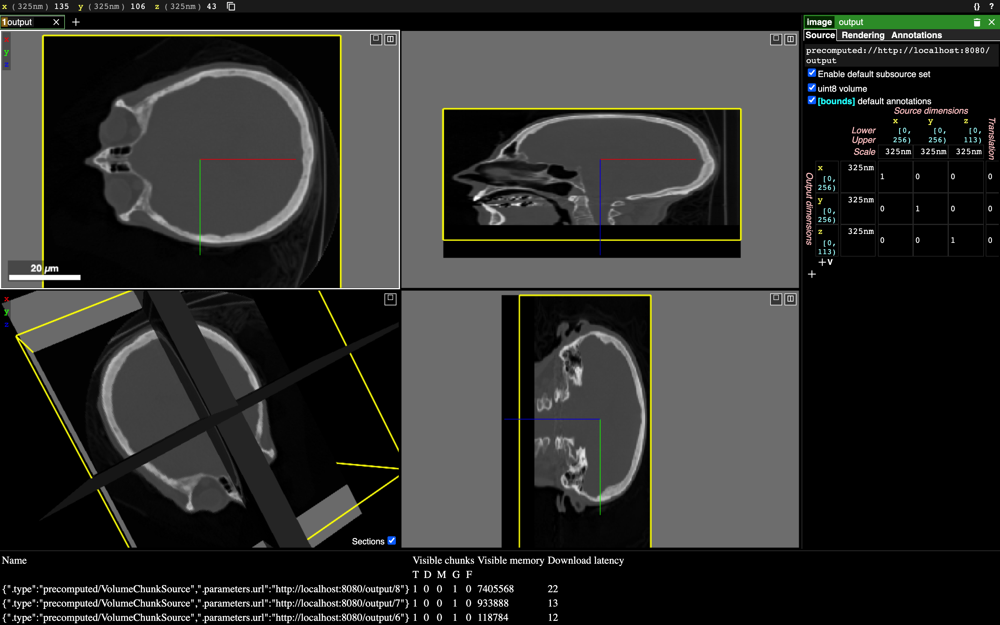
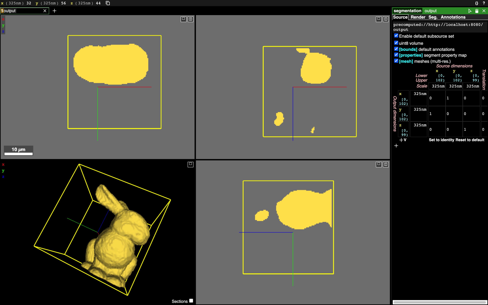

# Neurogen

Neurogen is a library for converting data into compatible formats with Neuroglancer.
The two types of outputs it can create are:
1) Volume generation
2) Mutli-resolutional meshes


**Installation**

```Ubuntu
pip intall neurogen --recursive-submodules
```

To set up local environment:
https://github.com/google/neuroglancer#building

**Volume Generation Example**


Download example data and unzip in appropriate input directory:
http://graphics.stanford.edu/data/voldata/cthead-8bit.tar.gz

More details of data: http://graphics.stanford.edu/data/voldata/

```python
import numpy as np
import os
from PIL import Image
from neurogen import volume as ngvolume
from neurogen import info as nginfo


# Unzip tar  file into appropriate directory
input = "/cthead_input/"
output = "/output/"

#  Generate Input
volume = np.zeros((256,256,113,1,1)).astype('uint8')
for filename in os.listdir(input):
    index = int(filename[11:14])
    filename = os.path.join(input,filename)
    image = Image.open(filename)
    imarray = np.array(image)
    volume[:,:,index,0,0] = imarray.astype('uint8')

volume_info = nginfo.info_image(directory=output, 
                                dtype=volume.dtype, 
                                chunk_size=[256,256,256],
                                size=volume.shape)

encodedvolume = ngvolume.generate_recursive_chunked_representation(volume, 
                volume_info, dtype=volume.dtype, directory=output,blurring_method='average')


```



**Mesh Generation Example (with Volume Generation)**

Download .STL file from https://www.thingiverse.com/thing:11622

Convert .STL file to images: https://github.com/cpederkoff/stl-to-voxel


```Ubuntu
mkdir bunny_pngs
git clone https://github.com/cpederkoff/stl-to-voxel
python3 stl-to-voxel/stltovoxel.py/bunny.stl /bunny_pngs/bunny.png
```


```python
import numpy as np
import os
import imageio

from neurogen import volume as ngvolume
from neurogen import mesh as ngmesh
from neurogen import info as nginfo

from skimage import measure
import trimesh

# Unzip tar  file into appropriate directory
input = "./bunny_pngs/"
output = "./output/"

#  Generate Input
volume = np.zeros((102,102,99,1,1)).astype('uint8')
for png in os.listdir(input):
    im = imageio.imread(os.path.join(input, png))
    index = int(png[5:8])
    volume[:,:,index,0,0] = im

IDS = np.unique(volume)
IDS = np.delete(IDS, 0) # remove the zero in list

info = nginfo.info_mesh(directory=output, 
                        dtype=volume.dtype, 
                        chunk_size=[256,256,256],
                        size=volume.shape,
                        ids = IDS,
                        labelled_ids = ['bunny'],
                        segmentation_subdirectory = "segment_properties")

encodedvolume = ngvolume.generate_recursive_chunked_representation(volume, 
                info, dtype=volume.dtype, directory=output)

for iden in IDS:
    print(iden)
    vertices,faces,_,_ = measure.marching_cubes((volume[:,:,:,0,0]==iden).astype("uint8"), level=0, step_size=1)
    mesh = trimesh.Trimesh(vertices=vertices, faces=faces)
    ngmesh.fulloctree_decomposition_mesh(mesh, num_lods=1, segment_id=iden, directory=output)
```

